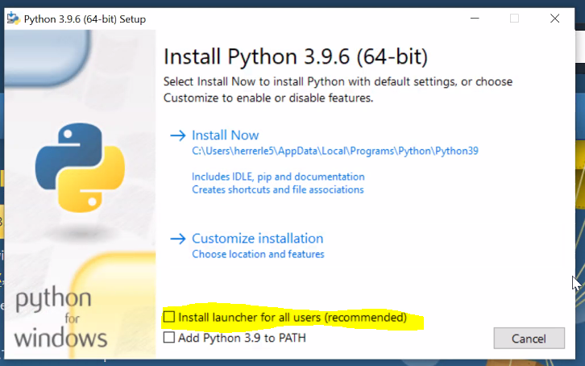
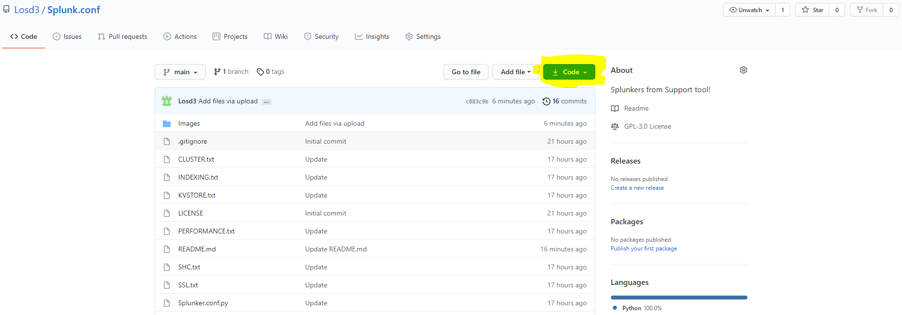
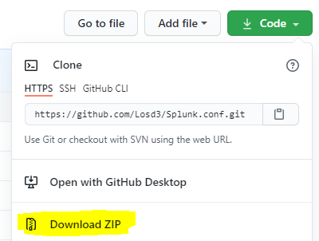
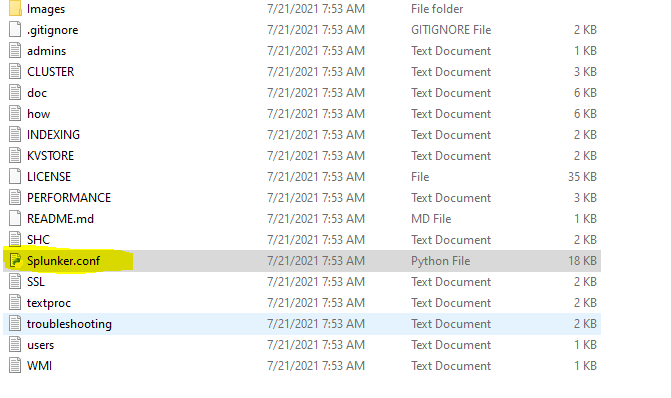

# Splunk.conf
Splunkers from Support tool! 

#Requirements:
- Install Python in your PC 
- Download the zip file of Splunk.conf
- Keep all .txt files in the Splunk.conf directory 

#Python installation 

Go to -> https://www.python.org/downloads/

Click on Download Python 

Remove the check from the "Install launcher for all users" And then Click on "Install now" 

With this, The python installation is complete! 

#Downloading Splunker.conf ZIP file

Go to the Top of the Web page and click on Code tap

After that click on Download ZIP 

After that Go to the folder where the zip files was downloaded and use the right click on it and then click on "Extract all"
You can move the directory to your desktop (desired) 

Open the folder and click on the Python File called Splunker.conf

<h1 align="center">Happy Splunking! </h1> 

