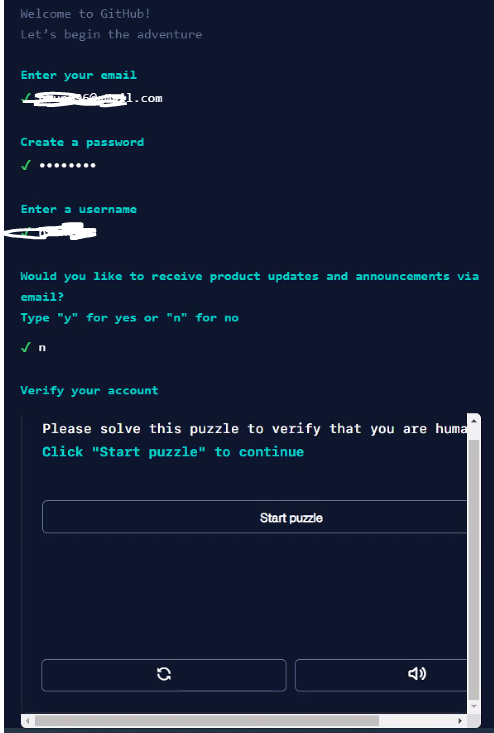

# Splunk.conf
Splunkers from Support tool! 

#Requirements:
- Install Python in your PC 
- Install GitHub Desktop
- Keep all .txt files in the Splunk.conf directory 

#Python installation 

Go to -> https://www.python.org/downloads/

Click on Download Python 

Remove the check from the "Install launcher for all users" And then Click on "Install now" 

With this, The python installation is complete! 

#Git Installation
Go to -> https://desktop.github.com/  and click on download 

Once the installer is downloaded click on it

Then continue by clicking on Sign in to GitHub.com 

Click on create an account

Complete the information and the puzzle 

Enter the code you received in your personal mail

Go back to the desktop git app click cancel and select Sign in to GitHub.com
Then allow to use the desktop App 

Once there, click on Clone a Repository 

And in the Repository URL paste: https://github.com/Losd3/Splunk.conf.git

Click on Show in Explorer

Open the folder and click on the Python File called Splunker.conf

<h1 align="center">Happy Splunking! </h1>

  

 

